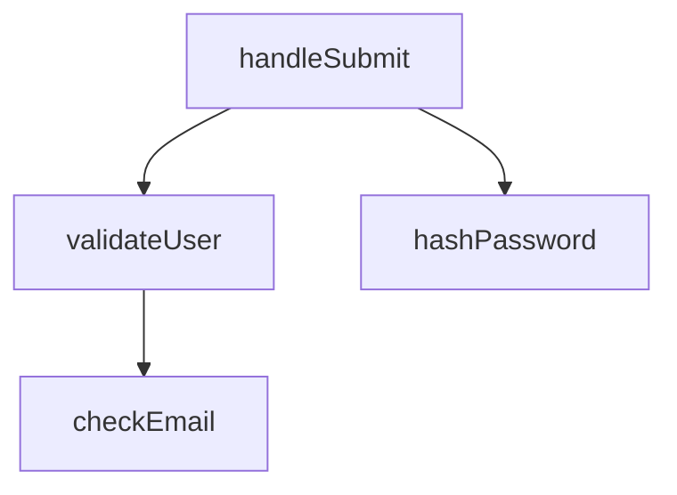
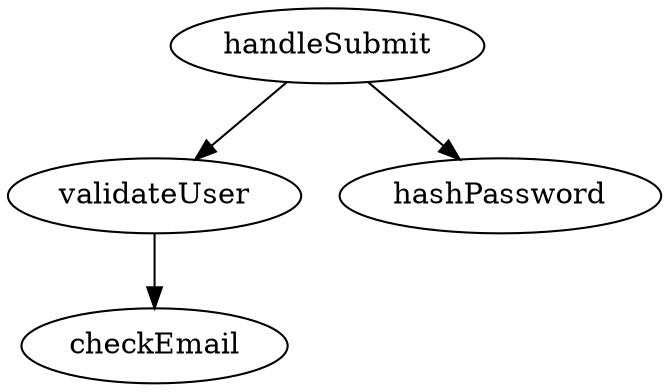

# Future Enhancements for Context Packer

This document outlines potential features and improvements that could be added to the Context Packer tool. These are organized by category and priority to help guide future development.

---

## 📋 Category 1: Configuration & Persistence

### 1.1 Config File Support
**Feature:** `.contextpackerrc.json` or `.contextpacker.config.js`

**Benefits:**
- Set project-wide defaults
- Share configuration with team
- Customize behavior per project

**Example:**
```json
{
  "defaultDepth": "logic",
  "defaultFormat": "markdown",
  "exclude": ["**/node_modules/**", "**/dist/**", "**/*.test.ts"],
  "include": ["src/**/*.ts", "src/**/*.tsx"],
  "preferredAI": "chatgpt",
  "autoCopy": true
}
```

### 1.2 User Preferences
**Feature:** Remember user choices across sessions

**Implementation:**
- Store in `~/.config/context-packer/preferences.json`
- Remember last used AI service
- Remember preferred export format
- Remember common flags

### 1.3 Analysis Profiles
**Feature:** Save and reuse named configurations

**Example:**
```bash
# Save current settings as a profile
context-packer myFunc --save-profile quick-review

# Use saved profile
context-packer otherFunc --profile quick-review
```

---

## 🔍 Category 2: Advanced Analysis Features

### 2.1 Multi-Function Analysis
**Feature:** Analyze multiple functions in one command

**Example:**
```bash
# Analyze multiple functions
context-packer handleSubmit,validateUser,processData

# Or from a file
context-packer --functions-file ./functions-to-analyze.txt
```

**Benefits:**
- Understand relationships between functions
- Get comprehensive context for refactoring
- Save time analyzing related functions

### 2.2 Call Hierarchy Visualization
**Feature:** Show complete call chain

**Example Output:**
```
handleSubmit (src/auth.ts:10)
  ├─ validateUser (src/utils.ts:5)
  │  └─ checkEmail (src/validators.ts:3)
  ├─ hashPassword (src/crypto.ts:8)
  └─ apiCall (src/api.ts:12)
```

### 2.3 Impact Analysis
**Feature:** Show what would be affected by changing a function

**Example:**
```bash
context-packer validateUser --impact-analysis
```

**Output:**
- Direct callers: 3 functions
- Indirect callers: 12 functions
- Files affected: 8
- Risk level: Medium

### 2.4 Dependency Graph
**Feature:** Visual graph of function dependencies

**Formats:**
- Mermaid diagram
- DOT (Graphviz)
- Interactive HTML

### 2.5 Dead Code Detection
**Feature:** Find unused functions

```bash
context-packer --find-unused --dir ./src
```

### 2.6 Complexity Metrics
**Feature:** Show cyclomatic complexity, lines of code, etc.

**Output:**
```
Function: handleSubmit
- Lines of Code: 45
- Cyclomatic Complexity: 8
- Number of Callers: 3
- Depth in Call Tree: 2
```

---

## 🌍 Category 3: Language Support

### 3.1 Python Support
**Parser:** Use `ast` or `tree-sitter`

**Example:**
```bash
context-packer process_data --dir ./python_app
```

### 3.2 Additional Languages
- **Java:** Parse with tree-sitter-java
- **Go:** Parse with tree-sitter-go
- **Ruby:** Parse with tree-sitter-ruby
- **C#/.NET:** Parse with Roslyn or tree-sitter
- **Rust:** Parse with tree-sitter-rust

### 3.3 Auto-Detection
**Feature:** Automatically detect language and use appropriate parser

```bash
# Auto-detects based on file extension
context-packer myFunction
```

---

## 📊 Category 4: Output Enhancements

### 4.1 Interactive HTML Output
**Feature:** Generate navigable HTML report

**Features:**
- Click to navigate between files
- Syntax highlighting
- Collapsible sections
- Search within results
- Dark/light theme

**Example:**
```bash
context-packer myFunc --format html --output report.html
```

### 4.2 Diff View
**Feature:** Show before/after for refactoring

**Use Case:**
- Understand impact of proposed changes
- Document refactoring decisions
- Code review preparation

### 4.3 Diagram Exports
**Mermaid:**


**Graphviz DOT:**


### 4.4 PDF Export
**Feature:** Professional PDF reports

**Use Cases:**
- Documentation
- Code review packets
- Architecture presentations

### 4.5 GitHub Gist Integration
**Feature:** Upload analysis to GitHub Gist

```bash
context-packer myFunc --gist --public
# Returns: https://gist.github.com/user/abc123
```

### 4.6 Share Links
**Feature:** Upload to temporary storage with shareable link

```bash
context-packer myFunc --share
# Returns: https://contextpacker.app/share/xyz789 (expires in 24h)
```

---

## 💻 Category 5: Developer Experience

### 5.1 Watch Mode
**Feature:** Re-analyze on file changes

```bash
context-packer myFunc --watch
# Watching src/**/*.ts for changes...
# File changed: src/auth.ts - Re-analyzing...
```

**Benefits:**
- Live feedback during refactoring
- Continuous context updates
- Development workflow integration

### 5.2 Git Integration
**Feature:** Analyze only changed functions

```bash
# Analyze functions changed in current branch
context-packer --git-diff main

# Analyze functions in specific commit
context-packer --git-commit abc123

# Analyze functions in PR
context-packer --git-pr 42
```

### 5.3 VS Code Extension
**Features:**
- Right-click function → "Analyze with Context Packer"
- View results in sidebar
- Quick copy to clipboard
- Direct integration with AI chat

### 5.4 JetBrains Plugin
**Similar to VS Code extension** for IntelliJ, WebStorm, PyCharm, etc.

### 5.5 GitHub Action
**Feature:** Automated context for PRs

**Example `.github/workflows/context-packer.yml`:**
```yaml
name: Context Packer
on: [pull_request]
jobs:
  analyze:
    runs-on: ubuntu-latest
    steps:
      - uses: actions/checkout@v2
      - uses: context-packer/action@v1
        with:
          functions: auto-detect
          comment-on-pr: true
```

### 5.6 Pre-commit Hook
**Feature:** Analyze before committing

**Example:**
```bash
# Install hook
context-packer --install-hook

# Pre-commit checks:
# - Analyze changed functions
# - Detect unused code
# - Check complexity thresholds
```

---

## 🤖 Category 6: AI Integration Enhancements

### 6.1 Custom AI Services
**Feature:** Add custom AI service URLs

**Config:**
```json
{
  "aiServices": {
    "perplexity": "https://www.perplexity.ai",
    "copilot": "https://github.com/copilot",
    "codeium": "https://codeium.com/chat"
  }
}
```

### 6.2 Direct API Integration
**Feature:** Send directly to AI APIs

```bash
# Send directly to OpenAI API
context-packer myFunc --ask-gpt "How can I optimize this?"

# Send to Claude API
context-packer myFunc --ask-claude "Are there any bugs?"
```

**Requires:**
- API key management
- Prompt template system
- Response formatting

### 6.3 Auto-Generate Prompts
**Feature:** Suggest questions based on analysis

**Example:**
```
Suggested prompts for 'validateUser':
1. "This function is called in 3 places. Can you help me refactor it to be more DRY?"
2. "Are there any security issues with this validation?"
3. "How can I add error handling to all callers?"
```

### 6.4 Prompt Templates
**Feature:** Pre-defined prompts for common scenarios

**Templates:**
- `refactor` - "Help me refactor this function to improve..."
- `debug` - "I'm getting an error in this function. Here's the context..."
- `optimize` - "How can I optimize this function's performance?"
- `security` - "Review this function for security vulnerabilities"
- `test` - "Generate unit tests for this function"

**Usage:**
```bash
context-packer myFunc --template refactor
```

### 6.5 Conversation History
**Feature:** Link analyses to AI conversations

**Benefits:**
- Track what you've asked about each function
- Review past AI suggestions
- Build knowledge base

---

## ⚡ Category 7: Performance & Scale

### 7.1 Caching
**Feature:** Cache analysis results

**Benefits:**
- Faster repeated analyses
- Reduced CPU usage
- Better for large codebases

**Implementation:**
```bash
# Enable cache
context-packer myFunc --cache

# Clear cache
context-packer --clear-cache
```

### 7.2 Incremental Analysis
**Feature:** Only re-analyze changed files

**Benefits:**
- Much faster on large projects
- Watch mode efficiency
- CI/CD optimization

### 7.3 Parallel Processing
**Feature:** Analyze multiple files concurrently

**Benefits:**
- 4-8x faster on multi-core systems
- Better for monorepos
- Efficient use of resources

### 7.4 Progress Indicators
**Feature:** Show progress during long analyses

**Example:**
```
Analyzing codebase...
[████████░░░░░░░░] 45% (120/267 files)
Found 12 references so far...
```

### 7.5 Memory Optimization
**Feature:** Stream processing for huge files

**Benefits:**
- Handle files > 10MB
- Support codebases > 100k files
- Prevent out-of-memory errors

---

## 👥 Category 8: Collaboration

### 8.1 Shared Results
**Feature:** Team database of analyses

**Use Cases:**
- Onboarding new developers
- Code review preparation
- Architecture documentation

### 8.2 Annotations & Comments
**Feature:** Add notes to analysis results

**Example:**
```bash
context-packer myFunc --annotate "This needs refactoring before v2.0"
```

### 8.3 Confluence/Notion Export
**Feature:** Export to documentation platforms

```bash
context-packer myFunc --export-confluence
context-packer myFunc --export-notion
```

### 8.4 Slack/Discord Integration
**Feature:** Share analyses in team chat

```bash
context-packer myFunc --post-slack #backend-team
```

### 8.5 Code Review Mode
**Feature:** Optimized output for PR reviews

**Includes:**
- Highlight changed lines
- Show test coverage
- List potential risks
- Suggest reviewers based on file history

---

## 🛡️ Category 9: Quality & Safety

### 9.1 Security Scanning
**Feature:** Integrate with security tools

**Example:**
```bash
context-packer myFunc --security-scan
```

**Checks:**
- SQL injection risks
- XSS vulnerabilities
- Hardcoded secrets
- Unsafe dependencies

### 9.2 License Compliance
**Feature:** Check for license issues in dependencies

### 9.3 Breaking Change Detection
**Feature:** Identify API breaking changes

**Example:**
```
⚠️ Warning: Changing 'validateUser' would break:
- 3 external consumers
- 2 public APIs
- 1 deprecated but still used
```

### 9.4 Test Coverage
**Feature:** Show test coverage for analyzed functions

**Output:**
```
Function: validateUser
- Unit tests: 2
- Integration tests: 1
- Coverage: 85%
- Untested paths: error handling for invalid email
```

### 9.5 Performance Impact
**Feature:** Estimate performance impact of changes

**Metrics:**
- Execution frequency
- Average execution time
- Memory usage
- Critical path analysis

---

## 📚 Category 10: Documentation

### 10.1 Auto-Documentation
**Feature:** Generate docs from analysis

**Output Formats:**
- JSDoc/TSDoc
- Markdown
- OpenAPI/Swagger
- README sections

### 10.2 API Documentation Mode
**Feature:** Extract and format API documentation

```bash
context-packer --api-docs --dir ./src/api
```

### 10.3 Changelog Generation
**Feature:** Generate changelogs from git history

```bash
context-packer --changelog --from v1.0.0 --to v2.0.0
```

### 10.4 Architecture Diagrams
**Feature:** Generate system architecture diagrams

**Types:**
- Component diagrams
- Sequence diagrams
- Class diagrams
- Deployment diagrams

---

## 🎯 Recommended Implementation Priority

### Phase 1: Quick Wins (1-2 weeks)
1. **Config file support** - High impact, medium complexity
2. **Multi-function analysis** - Frequently requested
3. **Watch mode** - Great for development workflow
4. **Custom AI service URLs** - Easy to implement

### Phase 2: Major Features (1-2 months)
1. **Python support** - Expand language support
2. **Interactive HTML output** - Better visualization
3. **Git integration** - Essential for CI/CD
4. **VS Code extension** - Reach more developers

### Phase 3: Advanced Features (2-4 months)
1. **Call hierarchy visualization** - Complex but valuable
2. **Caching & performance** - Scale to large projects
3. **GitHub Action** - CI/CD integration
4. **Direct AI API integration** - Automated workflows

### Phase 4: Ecosystem (4+ months)
1. **JetBrains plugin** - Alternative IDE support
2. **Team collaboration features** - Enterprise features
3. **Security scanning** - Quality assurance
4. **Additional language support** - Java, Go, C#

---

## 💡 Implementation Suggestions

### Start Small
- Pick 1-2 features from Phase 1
- Get user feedback
- Iterate based on usage

### Community Input
- Create GitHub discussions for feature requests
- Survey users on most wanted features
- Prioritize based on community votes

### Maintain Quality
- Add tests for all new features
- Update documentation
- Ensure backward compatibility
- Follow semantic versioning

---

## 🤝 Contributing

If you'd like to implement any of these features:
1. Open an issue to discuss the approach
2. Follow the existing code structure
3. Add comprehensive tests
4. Update documentation
5. Submit a PR with clear description

---

**Questions?** Open an issue or start a discussion on GitHub!
